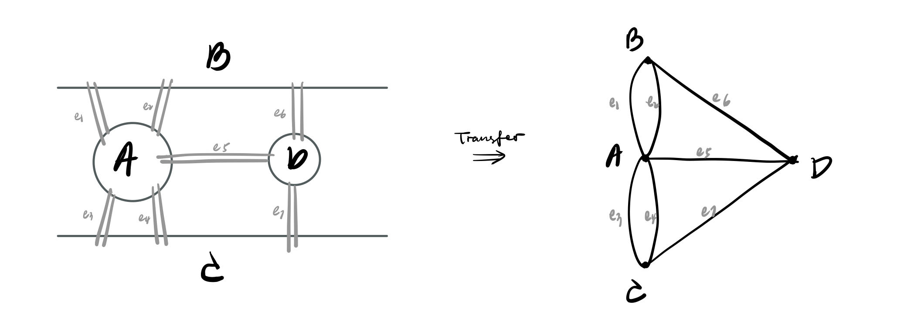
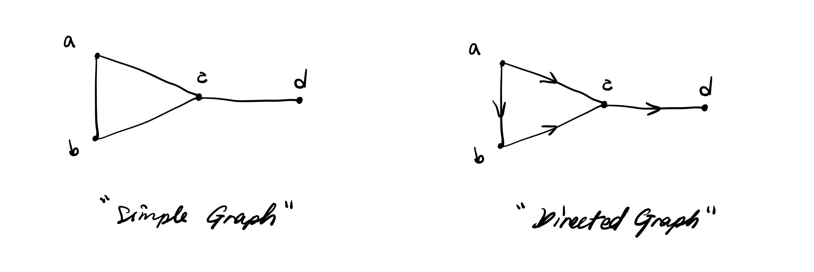
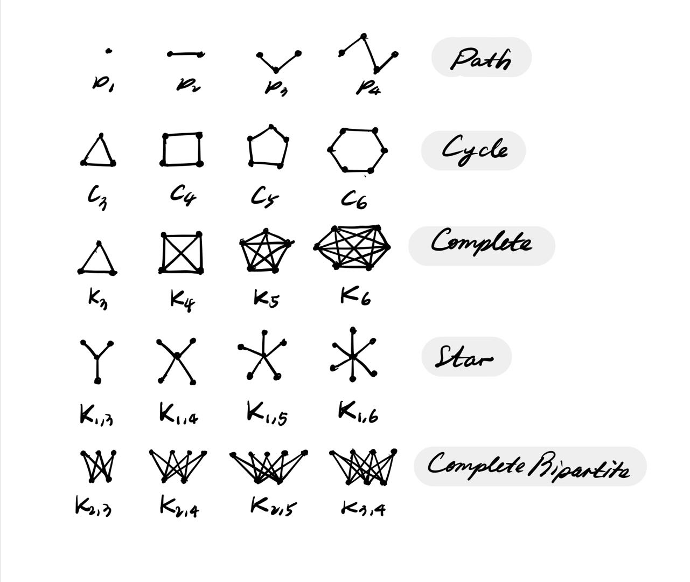

## **Graph Theory, Networks, and Data**

#### **<ins>Bridge Question</ins>**  

Can you walk across each bridge once and only once? (able to start anywhere)

    

The question is not a `geometric` one, instead it's a `relational` question, which means the distance of the node or the angle of nodes doesn't count in this question.

#### **<ins>Sol.</ins>**  

No way to complete it. 

Since each node here has odd edges. If a node has odd edges, then it's impossible to start and end at the same dot.

---

### **- Introducing Graph Networks** 

[**Idea**] Data not suitable to represent in tabular form.

[**Def**] A graph G is a set of nodes (vertices) V(G), and a set of edges E(G), where each edge in E(G) represent relationship on the nodes of G.

[**Type**]
- **Simple Graph**

    E(G) consists of non-ordered pairs of nodes (nodes no rep.)
- **Directed Graph**

    E(G) consists pf ordered pairs of nodes (nodes no rep.)

    

[**Subtype**]
* Paths
* Cycles
* Stars / Complete / Complete Bipartite etc.

    

[**Property**]

Let G be a graph.

* $N_G(V)=\{w: \{v,w\}\in E(G)\}$

* $N_G[V]=N_G(V)\cap \{V\}$

* $d_G(V)=|N_G(V)|$