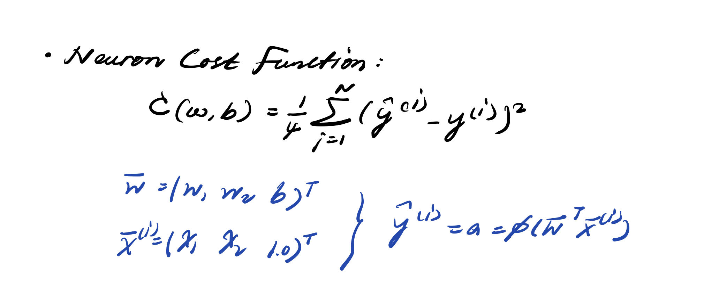

## **The Perceptron Algorithm**

### **Concept**

#### **Neurons and Neural networks**
Functions approximation models used in **regression** and **classification** tasks.

#### **The Single Neuron Model**

    

#### **The Perceptron Single Neuron Model**

    

#### **Neuron Cost Function** and **Model Update Rule**

1. Given labeled data D
2. For each $i$, feed forward $x^{(i)}$ into neuron model to output predict $\hat{y}^{(i)}$
    * **weight perceptron update rule**
    * **bias perceptron update rule**

    

3. Repeat until either:
    - A maximum number of **epochs** has reached
    - The cost function is outputting a sufficiently **small error**

    

---

### **Implement**

#### **Dataset Description**
In the impletation there're two datasets being used: **Iris dataset** and **Palmer Penguins Dataset**.
- **Iris dataset**
5 columns: 1 factor groups + 4 numeric parameters
    - Three species group: 'setosa' / 'verginica' / 'versicolor'
    - Numeric parameters: 'sepal_length' / 'sepal_width' / 'petal_length' / 'petal_width'
    
- **Palmer Penguins Dataset**
7 columns: 3 factor groups + 4 numeric parameters
    - Three species group: 'Adelie' / 'Chinstrap' / 'Gentoo'
    - Three island group: 'Biscoe' / 'Dream' / 'Torgersen'
    - Two gender group: 'Male' / 'Female'
    - numeric parameters: 'bill_length_mm' / 'bill_depth_mm' / 'flipper_length_mm' / 'body_mass_g'
Target: Using The perceptron model to classify species group using numeric parameters as measurements.

#### **Performance Conclusion**

1. If the data is not linearly seperable, than the classification may be false sometimes.
2. If the data of two groups overlap too much, the percentron model failed to classify the two group.
