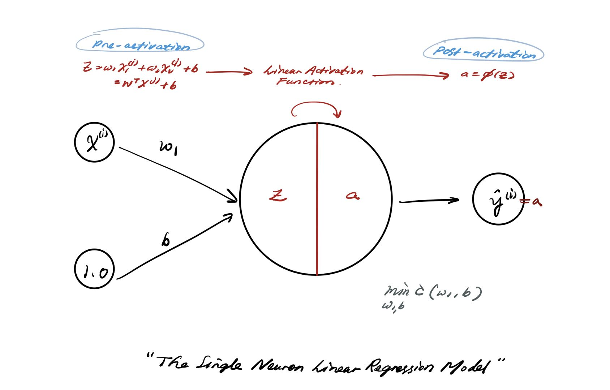

## The Gradient Descent
- **Field**: Unconstrained continuous optimization
- **First-order Method**
<p align="center" width="100%">
    
</p>

---
### **Concept**
The Concept of Gradient Descent is that "Gradient" (derivative for single variable function) provides a direction to "Descent" (optimize the function). 
```math
\min_{w\in \mathbb{R}} f(w) \;\;\;\;(Single\:Variable)
```
```math
\min_{w\in \mathbb{R^n}} f(w) \;\;\;\;(Multiple\:Variables)
```
So there're two important features to consider:

1. **Descent direction**
2. **Learning Rate $\alpha$**


```math
w_{n+1} = w_n - \alpha f'(w_n) \;\;\;\;(Update\:Rule\:for\:f\;of\:one\:Variable)
```
```math
(w_{n+1},\:f(w_{n+1})) \;\;\;\;(New\:pair\:for\:better\:choice\;of\:extrema\:value\:for\:f)
```
#### **Linear Regression Single Neuron Model**
Recall the lec3, but the target function $f$ is set to be a linear function. Also the activation function is set to be the linear one.
<p align="center" width="100%">
    
</p>

#### **Neuron Cost Function and Model Update Rule**
The cost function here we choose the **mean-squared error cost function**.
<p align="center" width="100%">
    
</p>

#### **Different Methods for Calculating the Full Partial Derivatives**
- Batch Gradient Descent Algiorithm
    For each epoch:
    1.  Caluculate the full gradient by
    ```math
    w_1 \leftarrow w_1 - \alpha \frac{\partial C}{\partial w_1}
    ``` 
    ```math
    b \leftarrow b - \alpha \frac{\partial C}{\partial b}
    ``` 
    2.  
- Stochastic Gradient Descent Algorithm (**Common** and **necessary** to find local minima)
---

### **Implementation**

#### **Dataset Description**
In the impletation the dataset **Palmer Penguins Dataset** being used.

Since the gradient descent here focus on linear regression, we are implement the method under these 4 numeric parameters:
- 'bill_length_mm' 
- 'bill_depth_mm' 
- 'flipper_length_mm' 
- 'body_mass_g'
Target: Using The Gradient Descent to perform regression on relationships between numeric parameters of a specific species.


#### **Performance Conclusion**