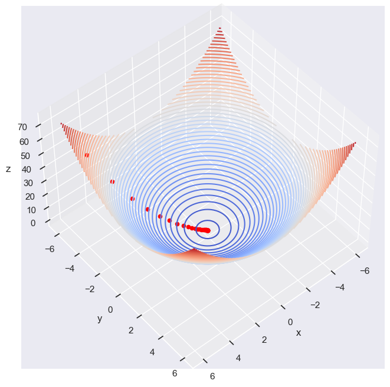

## The Gradient Descent
- **Field**: Unconstrained continuous optimization
- **First-order Method**
<p align="center" width="100%">
    
</p>

---
### **Concept**
The Concept of Gradient Descent is that "Gradient" (derivative for single variable function) provides a direction to "Descent" (optimize the function). 
```math
\min_{w\in \mathbb{R}} f(w) \;\;\;\;(Single\:Variable)
```
```math
\min_{w\in \mathbb{R^n}} f(w) \;\;\;\;(Multiple\:Variables)
```
So there're two important features to consider:

1. **Descent direction**
2. **Learning Rate $\alpha$**


```math
w_{n+1} = w_n - \alpha f'(w_n) \;\;\;\;(Update\:Rule\:for\:f\;of\:one\:Variable)
```
```math
(w_{n+1},\:f(w_{n+1})) \;\;\;\;(New\:pair\:for\:better\:choice\;of\:extrema\:value\:for\:f)
```

Always to find a suitable $\alpha$ through experimentaton.


---

### **Implementation**

#### **Dataset Description**

#### **Performance Conclusion**