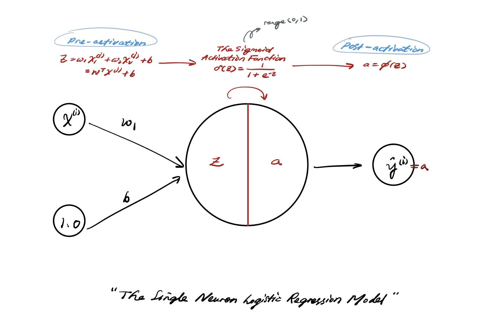

## The Single Neuron Model
A custom framwork and same stochastic gradient descent rule for the models listed below:
- The Perceptron Single Neuron Model
- The Linear Regression Single Neuron Model
- The Logistic Regression Single Neuron Model
---
### **Concept**

#### **- Logistic Regression Single Neuron Model**
Recall lec3.4, but the activation function set to be the **Sigmoid Activation Function** in order to predict the class probability.

    

#### **- Neuron Cost Function and Model Update Rule**
The cost function here we choose the **binary cross entropy loss function**.
---
### **Implementation**

#### **Dataset Description**
In the impletation the **candidates_data** dataset being used.
- **Candidates_data** : 4 columns 
    - Binary parameters: 'admitted' (0 or 1)
    - Integer parameters: 'work_experience' (Rate from 1 to 6)
    - Numeric parameters: 'gmat' / 'gpa' 

Target: Using different single neuron model to classify admitted or not using numeric parameters "gmat" and "gpa".