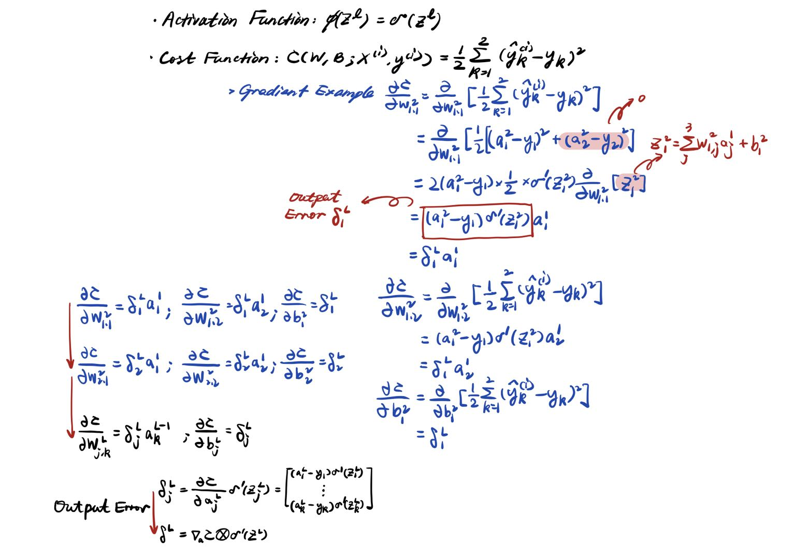
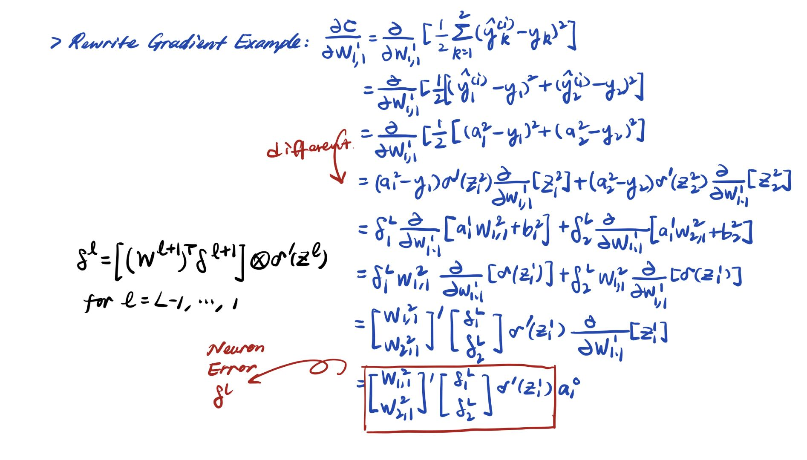

## The Dense Neuron Model

---
### **Concept**
#### **- The Neuron Networks**
* **Structure**:

    1 Input Layer + 1 sequence of Hidden Layer (multiple single nuerons) + 1 Output Layer
* Computational; highly composite
* Problem of latent **overfitting**
* **Work Flow**: (Iterate until arriving at an Output Value)

    Input Signal (feature measure) scaled by $\to$ 1st layer weights
    
    pass into $\to$ an activation function foward into $\to$ next layer
* **Learning Process**: (Same as Single Neuron Model)

     By minimizing the <ins>Cost Function</ins> by adjusting the <ins>Weights and Bias</ins> with some variant of <ins>Gradient Descent</ins>.

Recall lec5, the activation function set to be the **Sigmoid Activation Function** in order to predict the class probability.

<p align="center" width="100%">
    
</p>

#### **- Neuron Cost Function and Model Update Rule**
Implement stochastic gradient descent as well in each phase.
<p align="center" width="100%">
    
</p>

<p align="center" width="100%">
    
</p>

For each $i = 1, ..., N$:
1. Feedfoward $\mathbf{x}^{(i)}$ into the network 
2. Compute $\delta^{L} = \nabla_aC\otimes \sigma'(\mathbf{z}^{L})$
3. For $\ell = L, L-1, \dots, 1$:
    1. Compute $\delta^{\ell} = \big ( (\mathbf{w}^{\ell + 1})^{T} \delta^{\ell + 1} \Big )\otimes \sigma'(\mathbf{z}^{\ell})$
    2. Update $w$ and $b$ via the update rule:
```math
w^{\ell} \leftarrow w^{\ell} - \alpha \delta^{\ell}(\mathbf{a}^{\ell-1})^{T}
```
```math
b^{\ell} \leftarrow b^{\ell} - \alpha \delta^{\ell}
```


---

### **Implementation**

#### **Dataset Description**
In the impletation the **MNIST** dataset being used.
- **MNIST** : 70,000 images of hand written digits
    - Each image: $28\times 28$ grey scaled grid of pixel values
    - Pixel values: floating point numbers in the interval $(0,1)$
    - Meaning: darker pixels will have values closer to $1$ and lighter pixels will have values closer to $0$

Target: Using different single neuron model to classify admitted or not using numeric parameters "gmat" and "gpa".