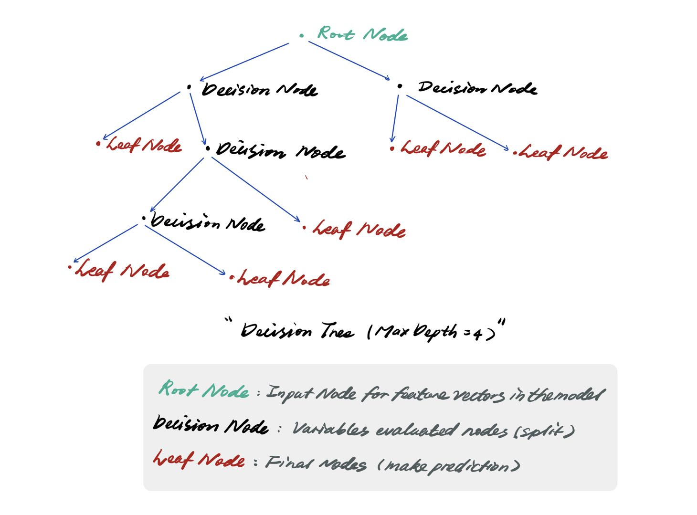

## The Decision Tree

---
### **Concept**
#### The Decision Tree (DT) 
* To predict the target of variable by learning multiple decision rules inferred from data features.
* Structure: **Nodes** and **Branches**

    

---

### **Implementation**

#### **Dataset Description**
In the impletation the **Titanic** dataset being used.
- **Titanic** : 12 columns (Using 7 columns as features)
    - Predicted label: survived (0 or 1)
    - Predict features: Pclass / Sex / Age / SibSp / Parch / Fare
    - Pre-processing the data for data type, NaN value and etc.

Target: Using predict features to predict survived or dead.
